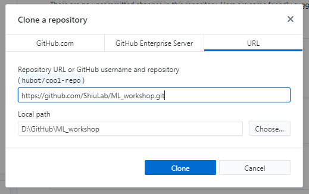

# How machine learning can be used to solve plant biology problems


## Workshop information

### What this is about

More and more data are available in plant science that have fueled ground breaking discoveries. Beyond the original intents of the experiments, these data can be used to discover even more. This is where machine learning come in - using computers to learn from data and generate models that can predict a biological phenomenon of interest - e.g. will this gene be lethal when it is knocked-out, or which genetic variants can meaningfully predict a phenotype of interests. Specifically, this workshop will touch on the following topics: What is machine learning and why is it useful? How does machine learning work? What are some example machine learning applications in plant science? How can we feed data into machine learning tools to make discoveries? What are the best practices when doing machine learning? Where to go to learn more? The workshop will include presentations, discussions, and a short hand-on section using online machine learning resources.

### When and where

* 3:30-4:30pm, 7/29/2020
* PlantBiology 2020 Worldwide Summit - Online
* [Event link](https://www.eventscribe.com/2020/ASPB/fsPopup.asp?Mode=presInfo&PresentationID=742105)

### Who we are

* Shin-Han Shiu: Departments of Plant Biology and Comp. Math., Sci., & Engr., Michigan State University
* Serena Lotreck: Department of Plant Biology and Comp. Math., Sci., & Engr., Michigan State University
* Our lab [website](https://shiulab.github.io/)

### What kinds of materials you are sharing

There are two main documents:
1. [Workshop presentation slides](https://github.com/ShiuLab/ML_workshop/blob/master/ML_workshop_presentation.pptx)
2. [Workshop jupyter notebook](https://github.com/ShiuLab/ML_workshop/blob/master/ML_workshop_example_run.ipynb)

## Instructions for runnning the notebook

* Developed by Christina Azodi for the [2019 workshop](https://github.com/azodichr/ML-Pipeline/tree/master/Workshop).
* Modified for the 2020 workshop by Shinhan Shiu.

### What's needed

The workshop example is provided as a [Jupyter notebook](https://jupyter-notebook-beginner-guide.readthedocs.io/en/latest/what_is_jupyter.html). It is a document generated by the [Jupyter Lab or Jupyter Notebook applications](](https://jupyter.org/install.html)). A notebook can contain both computer codes in popular languages such as Python and R, and texts in the form of paragraph, equations, figures, links, etc.

To follow what we have shown in the workshop, you need the following:
* Git: for you to "clone" this repository to your computer to play with.
* Jupyter Lab: the application to view, edit, and execute codes in the notebook.
* Scikit-Learn and others: the software packages Jupyter Lab relies on to run the codes.

### Install Git and clone ml_workshop

[Github](https://github.com/) is a code hosting platform for version control (i.e., keep track of updates to codes) and collaboration (i.e., many people can work on the same codes). We have put the workshop materials in a Github repository called [ML_workshop]()

1. Create a [GitHub Account](https://github.com/join)
2. Download and install [Github Desktop](https://desktop.github.com/)
  * Or you can use [Git](https://git-scm.com/book/en/v2/Getting-Started-Installing-Git) if you are familar with version control and command-line interface. Note that the following info is for using Github Desktop.
3. Clone the ML_workshop by following [this instruction](https://docs.github.com/en/desktop/contributing-and-collaborating-using-github-desktop/cloning-and-forking-repositories-from-github-desktop) and the following screenshot.
  * __Note:__ You can specify where the repository goes in your computer. Suggest leave it as default and remember where it is - we need it later.
  


### Install Anaconda

[Anaconda](https://www.anaconda.com/) is a a free and open-source distribution of the programming languages Python and R and is a widely used platform for computational and data science applications.

1. Download the Python 3.X version of [Anaconda](https://www.anaconda.com/products/individual#Downloads). Current, it is Python 3.7.
2. Install Anaconda using the [instructions](https://docs.anaconda.com/anaconda/install/).
3. Open your terminal in [Mac](https://support.apple.com/guide/terminal/open-or-quit-terminal-apd5265185d-f365-44cb-8b09-71a064a42125/mac) or [PC](https://www.wikihow.com/Open-Terminal-in-Windows) 
  * __Note__: For PC, you need to open the terminal by "Running as Administrator". If you are not familiar with this, see [this post](https://www.itechtics.com/run-programs-administrator/) for more info.
  
4. Issue the following command to make sure Anaconda installation is complete:
```
conda list
```
The above command allows you to see what software packages have been installed.

### Install software packages we need

[Conda](https://docs.conda.io/en/latest/) is a package/environment management system. It deals with installing software packages in your computer. It also creates and manage virtual environments where each environment you have a specific set of software for a general category of tasks.  

1. Create an ml environment and activate it:
```
conda create -n ml
conda activate ml
```

2. Install software packages and their dependencies:
```
conda install jupyterlab matplotlib nb_conda pandas scikit-learn
```

### Navigate to ML-Pipeline tutorial 

1. In your terminal, run Jupyter Lab by typing:

```
jupyter lab
```

2. In the browser window that opens, navigate to __ML_workshop__, the directory where the cloned Github repository is stored.

3. Open ML_workshop.ipynb

4. Run each code element by clicking ```SHIFT + ENTER```.
